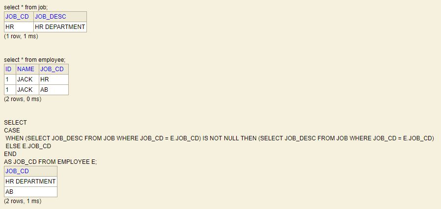

## Select Queries
* select all records from table employee
```
select * from employee;
```
* Add 30 seconds to current date
```
select sysdate NOW, sysdate+30/(24*60*60) NOW_PLUS_30_SECS from dual;
```
* Convert 24 Hour time to 12 Hour plus AM/PM indication Oracle SQL
```
SELECT invoice_date,
 TO_CHAR(invoice_date, 'DD-MM-YYYY HH24:MI:SS') "Date 24Hr",
 TO_CHAR(invoice_date, 'DD-MM-YYYY HH:MI:SS AM') "Date 12Hr"
FROM invoices;
```
* Check the date is future date or not
```
SELECT APPT_BEG_DATETIME, TO_DATE(CURRENT_DATE, 'DD-MON-YY HH24:MI:SS') AS TODAY,
CASE 
	WHEN TO_DATE(APPT_BEG_DATETIME, 'DD-MON-YY HH24:MI:SS') > TO_DATE(CURRENT_DATE, 'DD-MON-YY HH24:MI:SS') THEN 'YES' ELSE 'NO' 
END AS IS_FUTURE
FROM SH_APPOINTMENTS;
```
* Select User
```
SELECT USER FROM DUAL;
```
* Save current session sql commands to file. File will be saved on running `SPOOL OFF`
```
SPOOL [path]\[fileName].extension
```
* Group by create date
```
select count(*), to_char(create_date,  'DD-MON-YY') from MY_TABLE group by to_char(create_date,  'DD-MON-YY');
```
* Group by create date and descending order of date
```
select count(*), to_date(create_date,  'DD-MON-YY') from MY_TABLE group by to_date(create_date,  'DD-MON-YY') order by to_date(create_date,  'DD-MON-YY') desc;
```

## Case Statements
* Case in Select Query
```
DROP TABLE JOB IF EXISTS;

CREATE TABLE JOB (JOB_CD VARCHAR(10) PRIMARY KEY, JOB_DESC VARCHAR(20));

DROP TABLE EMPLOYEE IF EXISTS;

CREATE TABLE EMPLOYEE (ID NUMBER, NAME VARCHAR(20), JOB_CD VARCHAR(10));

INSERT INTO JOB VALUES ('HR', 'HR DEPARTMENT');

INSERT INTO EMPLOYEE VALUES (1, 'JACK', 'HR');
INSERT INTO EMPLOYEE VALUES (1, 'JACK', 'AB');

COMMIT;

SELECT 
CASE  
 WHEN (SELECT JOB_DESC FROM JOB WHERE JOB_CD = E.JOB_CD) IS NOT NULL THEN (SELECT JOB_DESC FROM JOB WHERE JOB_CD = E.JOB_CD)
 ELSE E.JOB_CD 
END
AS JOB_CD FROM EMPLOYEE E;
```
